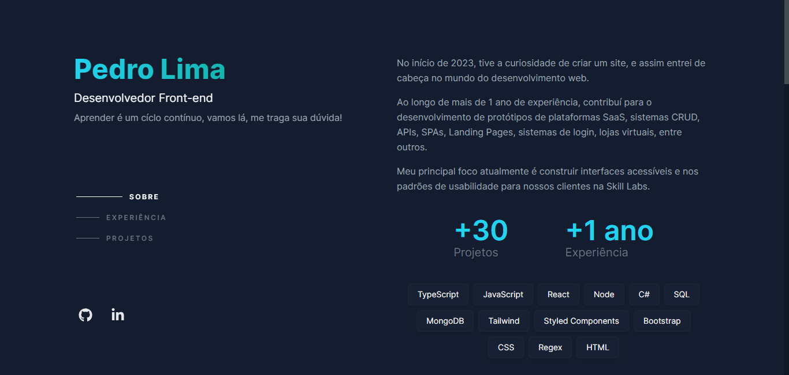

# Portfólio

Uma aplicação de página única (SPA) do meu próprio portfólio de projetos.

A página web é de minha autoria e foi inspirada em outras aplicações já existentes, adaptando seus designs e recursos. A aplicação foi desenvolvida utilizando tecnologias como TypeScript, Next.js, MongoDB, TailwindCSS e CSS.

## Índice

- [Screenshots](#screenshots)
- [Objetivos](#objetivos)
- [Minha caminhada](#minha-caminhada)
  - [Propriedades e Tecnologias](#propriedades-e-tecnologias)
  - [O que aprendi](#o-que-aprendi)
- [Rodando o projeto](#rodando-o-projeto)
- [Autor](#autor)

</br>

## Screenshots



</br>

## Objetivos

O principal objetivo deste projeto foi elaborar uma SPA do meu portfólio com uma página administrativa, conectado a uma API.

Os usuários têm a capacidade de:
- Como cliente, é possível visualizar a pagina e navegar entre as opções do menu.
- Como administrador, estão disponíveis, além da página inicial, outras duas: a de login e a de administração. A primeira destina-se ao processo de autenticação e a segunda permite a edição das informações exibidas na página inicial.

> OBS - Apenas o criador do projeto tem acesso à página administrativa.

</br>

## Minha caminhada

- [x] Protótipo do design
- [x] Estrutura de rotas front-end
- [x] Estrutura de rotas back-end
- [x] Modelo de objetos
- [x] Conexão e seviços da API
- [x] Controle de rota público/privada
- [x] Aplicação do design

</br>

## Propriedades e Tecnologias

- TypeScript
- Next.js
- Mongoose
- MongoDB
- CSS
- TailwindCSS
- Framer Motion
- Figma

</br>

## Meu aprendizado

Ao me deparar com o banco de dados do MongoDB pela primeira vez, tive como aprendizado o aspecto de modelagem de objetos que é elaborado pelo Mongoose.

<!--  
```tsx
import { NextResponse } from "next/server";
import { NextRequest } from "next/server";
 
export function middleware(request: NextRequest) {
  // Busca e pega o valor do token
  const token = request.cookies.get("auth_user")?.value;
  // Se o token não existir
  if (!token) {
    // E se o usuário estiver na rota "/"
    if (request.nextUrl.pathname == "/") {
      // Prossiga sem encaminhar
      return NextResponse.next();
    }
    // Encaminha o usuário para a rota "/"
    return NextResponse.redirect(new URL("/", request.url));
  }
  //Se o token existir e o usuário quiser acessar a rota "/"
  if (request.nextUrl.pathname == "/") {
    // Encaminhe o usuário para a rota "dashboard"
    return NextResponse.redirect(new URL("/dashboard", request.url));
  }
}

export const config = {
  // Rotas afetadas
  matcher: ["/", "/dashboard/:path*"]
};
```

O arquivo é composto pela função middleware e um objeto de configuração chamado "matcher".

A função middleware recebe o parâmetro "request", que nos concede acesso aos cookies e componentes da URL da web. Isso nos permite instanciar o token para trabalhar com condições baseadas nele. Outro elemento crucial é o "NextResponse", o qual precisamos importar de "next/server". Ele nos possibilita direcionar as rotas para onde o usuário será encaminhado.

O objeto "matcher" será responsável por definir quais rotas serão impactadas pela função middleware.

> Para saber mais consulte a [documentação!](https://nextjs.org/docs/app/building-your-application/routing/middleware)

</br>
-->

## Rodando o projeto


### Acesse a aplicação via web [aqui!](https://portifolio-pedroalima.vercel.app/)

#### Ou instale na sua máquina. Para conferir a versão final, é só realizar os seguintes passos:

### 1 - Clonando o Projeto:
Navegue até o diretório onde deseja clonar o projeto. Abra o terminal com o GitBash e execute o comando:

```bash
git clone URL_DO_REPOSITORIO
```
Substitua URL_DO_REPOSITORIO pela URL do repositório deste projeto.

#### 2 - Instalando Dependências:
Navegue até a pasta clonada do projeto e execute o comando no terminal:

```bash
npm install
```
ou
```bash
yarn install
```

#### 3 - Executando o Projeto:
Ainda na pasta do projeto, execute o comando no terminal:

```bash
npm run dev
```
Isso iniciará o servidor de desenvolvimento Next.

</br>

## Autor

- LinkedIn - [Pedro A. Lima](https://www.linkedin.com/in/pedroalima6/)